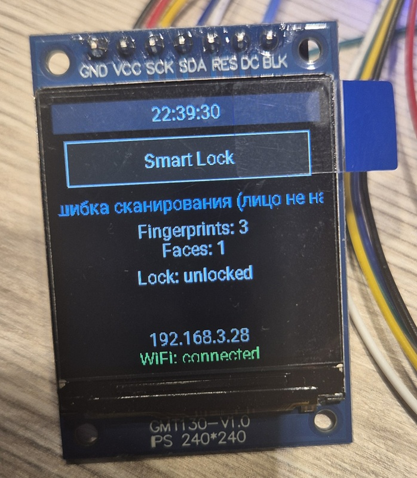
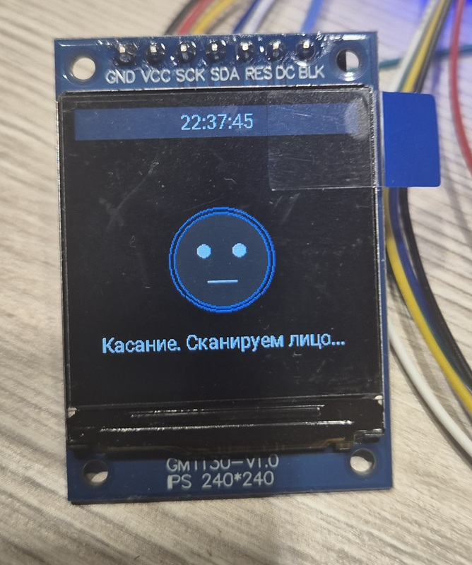
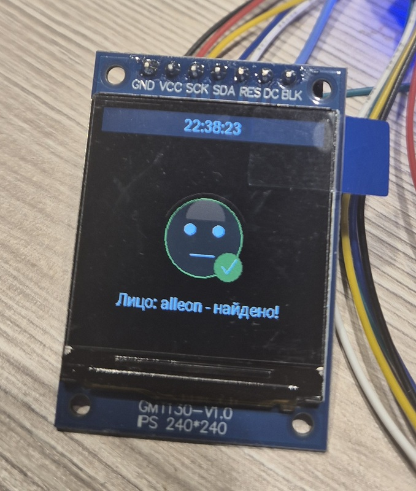
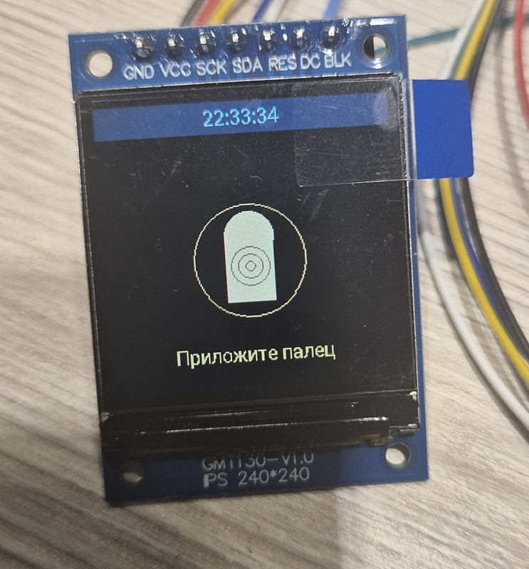
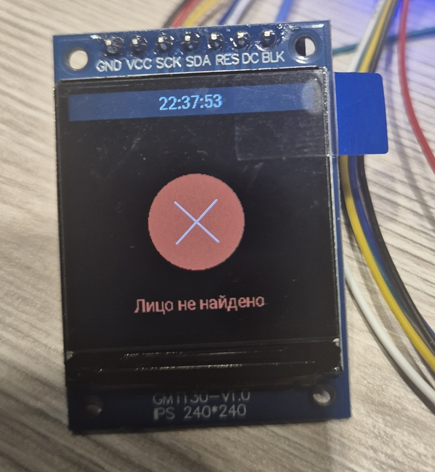
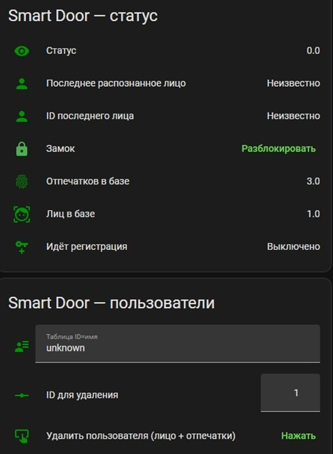
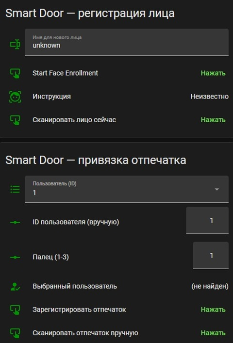
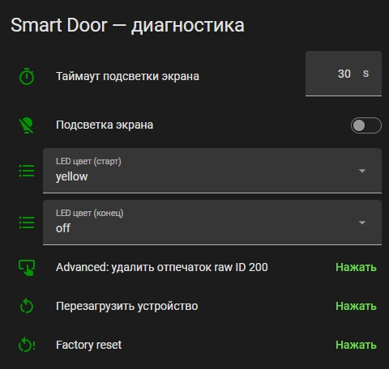

# Smart Door — умный замок Gimdow A1 Ultra с двухфакторной биометрией (лицо + отпечаток) на ESP32-S3: ESPHome + Home Assistant

Двухфакторная биометрическая аутентификация для электронного замка
**Gimdow A1 Ultra**: **распознавание лица → подтверждение отпечатком
пальца → открытие замка**. Своя плата на ESP32-S3-WROOM-1U-N16,
спроектирована в EasyEDA.


## 📷 Фото и скриншоты

Экран в разные моменты сценария 2FA — обычный дашборд, скан лица,
лицо найдено, ожидание отпечатка, отказ:

| Дашборд (ожидание) | Скан лица | Лицо найдено |
|---|---|---|
|  |  |  |

| Ожидание отпечатка (2FA) | Лицо не распознано |
|---|---|
|  |  |

Карточки дашборда Home Assistant:

| Статус + пользователи | Регистрация + привязка отпечатка | Диагностика |
|---|---|---|
|  |  |  |

<!-- TODO: добавить фото платы/сборки -->
<!--  -->
<!--  -->

## 🧩 Железо

| Компонент | Модель | Связь с ESP32-S3 |
|---|---|---|
| Распознавание лиц | HLK-FM22x | UART |
| Сканер отпечатков | SFM v1.7 | UART |
| Электронный замок | Gimdow A1 Ultra | BLE |
| Дисплей | ST7789, 240×240, SPI | SPI |
| MCU | ESP32-S3-WROOM-1U-N16 | — |

Схема платы (EasyEDA): [`docs/schematic.pdf`](docs/schematic.pdf).

### Карта пинов

| Назначение | Пин ESP32-S3 |
|---|---|
| UART "лицо" (FM22x) | tx=GPIO39, rx=GPIO40 |
| UART "отпечаток" (SFM) | tx=GPIO17, rx=GPIO18 |
| IRQ отпечатка | GPIO9 |
| Питание сенсора отпечатка (не используется физически, обязателен для компонента) | GPIO6 |
| SPI дисплея (SCL/SDA) | clk=GPIO41, mosi=GPIO42 |
| Дисплей RESET / DC | GPIO4 / GPIO14 |
| Подсветка дисплея (BLK) | GPIO5 |
| EN (обвязка платы) | R 10 кОм → 3V3, C 1 мкФ → GND, кнопка SW1 → GND |

Strapping-пины (IO0, IO3, IO45, IO46) сознательно оставлены свободными.

## ⚙️ Как это работает

### Регистрация пользователя
1. Вводим имя → кнопка **Start Face Enrollment** → 5 ракурсов лица.
   После успеха ESP сам присваивает ID и подставляет его для привязки отпечатка.
2. Кнопка **Зарегистрировать отпечаток для пользователя** → прикладываем
   палец. ID отпечатка = `(ID_пользователя − 1) × 3 + номер_пальца` — так
   владелец однозначно вычисляется по совпавшему отпечатку, без отдельной
   таблицы соответствий. До 3 пальцев на пользователя.
3. Для привязки отпечатка к уже существующему пользователю — выбрать его
   в select "Пользователь" вместо ручного ввода ID.

### Рабочий сценарий (2FA)
1. Касание пальцем сенсора в режиме ожидания запускает **скан лица**
   (не отпечатка).
2. Если лицо распознано — 15 секунд ожидания повторного касания.
   Экран показывает иконку пальца с подсказкой.
3. Повторное касание сверяет отпечаток. Если он принадлежит **тому же**
   пользователю, что и распознанное лицо — замок открывается.
   Если отпечаток чужой / не распознан / истекло время — отказ,
   возврат в режим ожидания.

На экране во время сценария показываются простые векторные "анимированные"
иконки (лицо → галочка → палец → итог), нарисованные примитивами ESPHome
display API — без файлов изображений/GIF.

## 📁 Структура репозитория

```
smart-door/
├── esphome/
│   ├── smart-door.yaml        # основной конфиг ESPHome
│   └── secrets.yaml.example   # шаблон секретов (скопировать в secrets.yaml)
├── home-assistant/
│   └── smart-door-dashboard.yaml  # карточки Lovelace для HA
└── docs/
    ├── schematic.pdf           # схема платы (EasyEDA)
    └── images/                 # фото/скриншоты
```

## 🚀 Установка

1. Скопируйте `esphome/secrets.yaml.example` → `esphome/secrets.yaml`,
   заполните Wi-Fi и данными замка Gimdow (из Tuya Cloud/IoT Platform).
2. Соберите и прошейте `esphome/smart-door.yaml` через ESPHome
   (Dashboard или CLI: `esphome run smart-door.yaml`).
3. Добавьте устройство в Home Assistant (обнаружится автоматически через
   ESPHome-интеграцию).
4. Для удобной панели — вставьте карточки из
   `home-assistant/smart-door-dashboard.yaml` (по одной, тип "Вручную").

## ⚠️ Известные особенности / на заметку

- `fingerprint_sfm.sensor_power_pin` — обязателен для компонента, но
  физически на этой плате не разведён (сенсор запитан статически от 3.3В).
- Направление UART к FM22x (`tx=GPIO39, rx=GPIO40`) подтверждено опытным
  путём на реальном железе — отличается от того, что подсказывали имена
  цепей на схеме.
- Дисплей использует `platform: mipi_spi` (актуальный драйвер ESPHome,
  `ili9xxx` для этой модели устарел). `cs_pin` не используется — у модуля
  дисплея CS физически не выведен.
- Шрифт требует явного списка `glyphs` с кириллицей — ESPHome по умолчанию
  грузит только ASCII.

## 📄 Лицензия

<!-- укажите лицензию по желанию, например MIT -->
